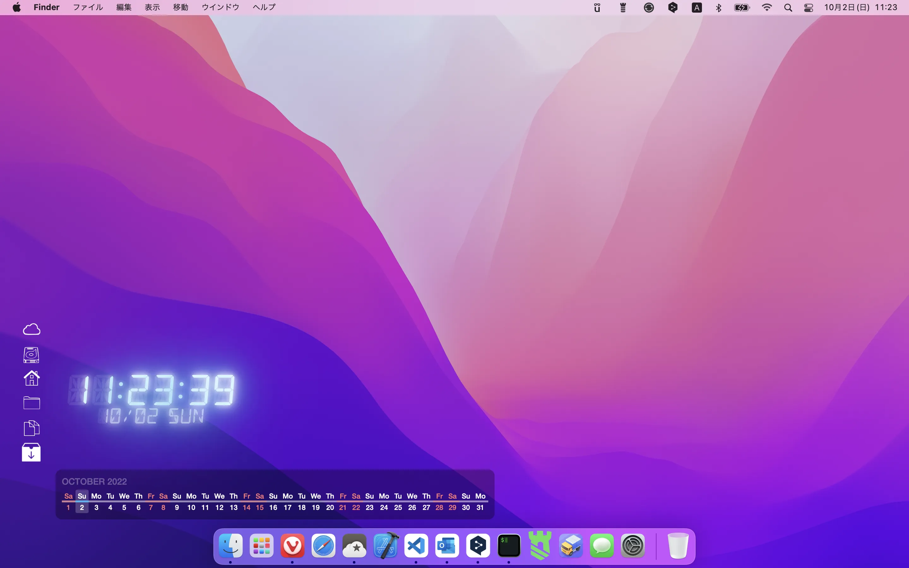
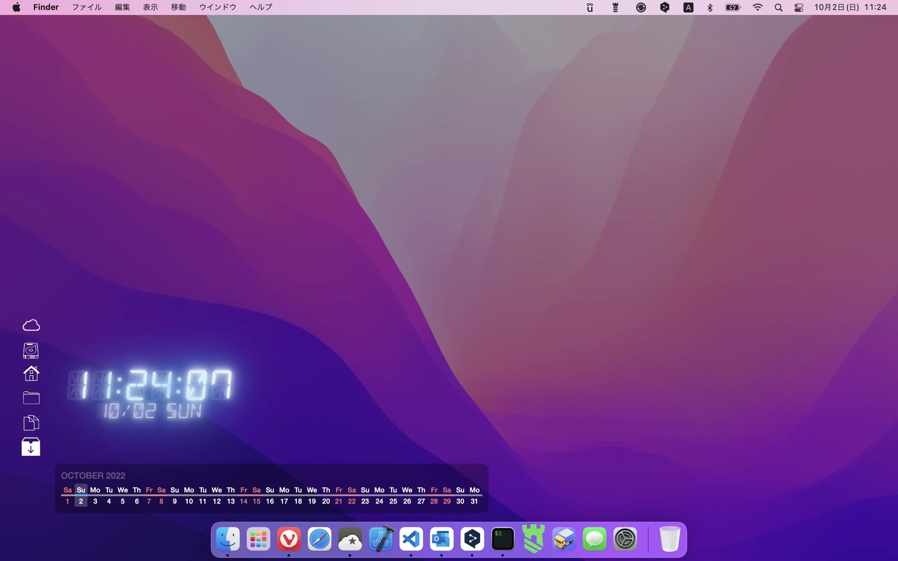

# dark-mode.widget
## This widget applies a dark mode to the background.

\* This widget should be run with `send to background`.

|Not applied|Apply|
|:-:|:-:|
|||

## Settings
The behavior changes with the value of the variable in index.jsx in the dark-mode.widget folder.

| name | required | description | remarks |
| :- | :-: | :- | :- |
| baseTransparency | ○ | The basic transparency of the background. ||
| maxTransparency | △ | Maximum decrease in transmitted due to night shift. | Only if night shift is enable. |
| nightShift | ○ | Enables of disables the function to vary transmittance by time of day. ||
| nightStart | △ | Start time of the night shift. | Only if night shift is enable. |
| nightEnd | △ | End time of the night shift. | Only if night shift is enable. |
